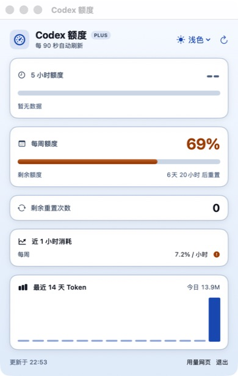

# Codex Quota Monitor for macOS

[English](README_EN.md) | **简体中文**

一个轻量、原生的 macOS Codex 额度监视器。它常驻菜单栏，并提供独立额度窗口，用来查看 5 小时与每周额度、重置时间、Token 活动和消耗趋势。


## 界面预览



## 功能

- 菜单栏直接显示 5 小时与每周剩余额度
- 独立额度窗口；关闭窗口后继续在菜单栏运行
- 高对比度深色/浅色主题，选择会自动保存
- 5 小时/每周额度、重置倒计时与剩余重置次数
- 每 90 秒自动刷新，也可手动刷新
- 最近 1 小时消耗速度与预计耗尽趋势
- 从本机 Codex 会话聚合最近 14 天 Token 活动
- 悬浮任意 Token 柱体即可查看对应日期和精确用量
- 网络失败时读取最近一次本地额度记录
- 单实例保护：重复启动时激活已有应用
- 原生 SwiftUI，无 Electron、Node.js 或第三方运行时依赖
- Universal 2，同时支持 Apple Silicon 与 Intel Mac

## 系统要求

- macOS 13 Ventura 或更高版本
- 已通过 Codex App 或 Codex CLI 登录
- 源码构建需要 Apple Command Line Tools 或 Xcode

## 构建与运行

```bash
git clone https://github.com/sherunlock03/CodexQuotaMonitor-macOS.git
cd CodexQuotaMonitor-macOS
./scripts/test.sh
./scripts/build_app.sh
open dist/CodexQuotaMonitor.app
```

构建脚本会生成：

```text
dist/CodexQuotaMonitor.app
```

建议将 App 移入 `/Applications` 后再打开。如果 macOS 阻止首次启动，请在 Finder 中右键应用并选择“打开”。

## 数据来源与隐私

- 每次刷新重新读取 `~/.codex/auth.json`。
- 登录令牌只在内存中使用，不写入日志、设置或分析文件。
- 网络请求只发往 `https://chatgpt.com/backend-api/wham/usage`。
- 最近 14 天 Token 活动只聚合 `~/.codex/sessions` 中的日期和 Token 数量，不保存或上传对话正文。
- 趋势采样保存在 `~/.codex/quota-monitor/usage-history.json`，只包含时间与额度百分比。

## 项目结构

```text
Sources/CodexQuotaMonitor/   SwiftUI App、额度服务、解析器与本地分析
Tests/SelfTest/              零依赖解析和趋势预测自检
Resources/                   Info.plist 与原生绘制的 App 图标
docs/screenshots/            README 界面截图
scripts/                     构建、自检与图标生成脚本
```

## 重要说明

OpenAI 目前没有发布供第三方菜单栏应用使用的正式 Codex 额度 API。本项目使用 Codex 当前调用的账户额度接口；如果服务端接口或字段发生变化，解析器也需要同步更新。

本项目是非官方社区工具，与 OpenAI 无隶属或背书关系。

## 致谢

数据模型与交互思路参考了 Windows 项目 [SherUnlocked-4869/CodexQuotaWidget](https://github.com/SherUnlocked-4869/CodexQuotaWidget)。

## License

[MIT](LICENSE)
